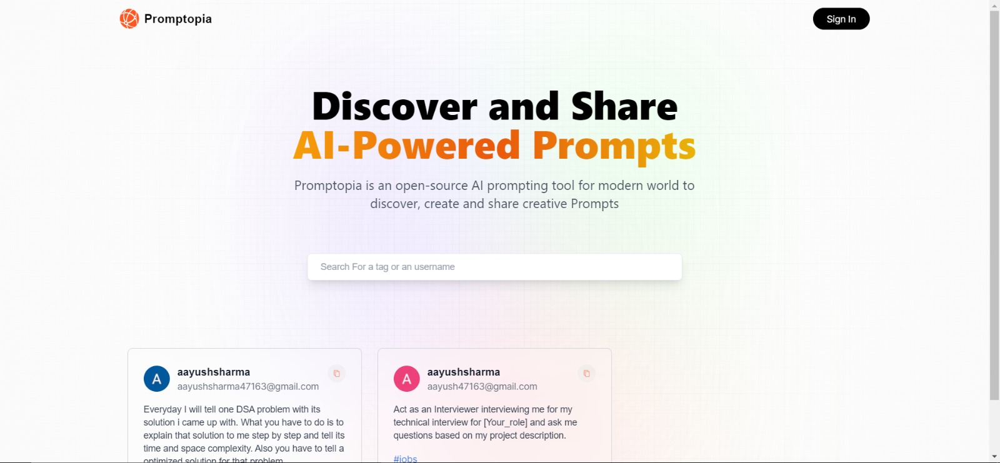

# Promptopia ✨

### Your Dynamic AI Prompt Oasis

## Project Overview

Embark on a journey into creative inspiration with Promptopia, a Full Stack application meticulously crafted with Next.js, Tailwind CSS, NextAuth, and MongoDB. This platform provides a dynamic space for AI-generated prompts, ensuring a seamless user experience through robust authentication and efficient data management.

## Tech Stack Used

- **Frontend**: Next.js, Tailwind CSS
- **Backend**: Next.js API Routes
- **Database**: MongoDB
- **Authentication**: NextAuth

## Features

1. **👥 User-Created AI Prompts**: Unleash your creativity by crafting your AI prompts, contributing to a vibrant community of imaginative minds. Share your prompts with others, fostering collaboration and inspiration.

2. **🚀 Dynamic Full Stack Application**: Promptopia is engineered to be dynamic, offering users a fully immersive experience. The blend of Next.js and NextAuth ensures a responsive and secure platform for creative exploration.

3. **🔄 MongoDB Integration**: Leveraging the power of MongoDB, Promptopia achieves efficient data storage and retrieval. This enhances the scalability and performance of the application, ensuring a smooth experience even as the user base grows.

4. **🌐 NextAuth for Robust Authentication**: NextAuth is seamlessly integrated to provide a robust user authentication system. Users can trust Promptopia with their data, ensuring a secure and personalized experience.

## Screenshots

### HomePage




### Create Prompt Page


### User Profile Page


### Other User's Profile Page


## Steps to Run Locally

### Prerequisites

- Node.js (v14 or higher)
- MongoDB (MongoDB Atlas)
- Git

### Installation

1. **Clone the repository:**

    ```bash
    git clone https://github.com/Aayush987/Promptopia
    cd promptopia
    ```

2. **Backend & Frontend Setup:**

    ```bash
    npm install
    ```

    - Create a `.env` file in the root directory and add the following environment variables:

        ```env
        MONGODB_URI=your_mongodb_connection_string
        NEXTAUTH_URL=http://localhost:3000
        NEXTAUTH_SECRET=your_nextauth_secret_key
        ```

3. **Run the development server:**

    ```bash
    npm run dev
    ```

4. **Access the App:**

    - Open your browser and navigate to `http://localhost:3000`.

## Conclusion

Promptopia offers a vibrant platform for creative individuals to explore, create, and share AI-generated prompts. With a robust tech stack and intuitive features, it ensures a seamless and secure user experience. Dive into the world of creative inspiration with Promptopia!
